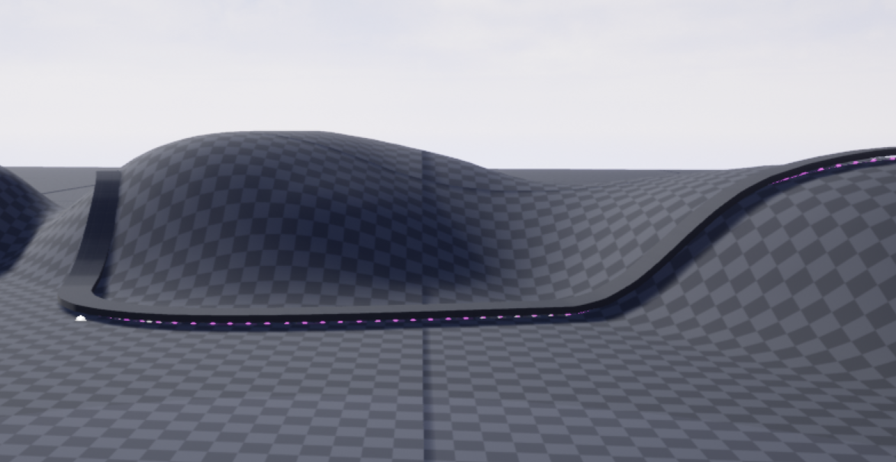
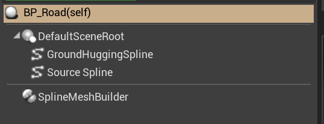
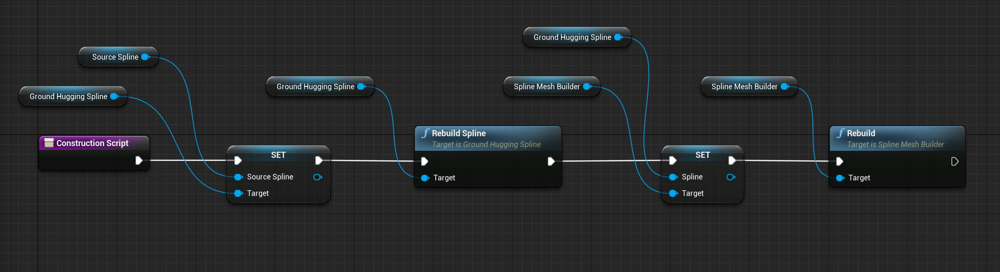

# Making roads
Making road meshes is easy in Unreal Engine using the USplineMeshComponent, but it is even easier with
a couple of components supplied by GenOs - USplineMeshBuilder and UGroundHuggingSpline.

The BP_Road actor in the plugin content shows an example of how to use these components.

## USplineMeshBuilder
The spline mesh builder simplifies the process of adding **USplineMeshComponents** to an actor. It has 
the following properties:
* **Spline** - The spline that should be followed
* **Mesh** - The mesh that will be repeated along the spline
* **VerticalOffset** - The meshes will be placed at this vertical offset from the spline
* **CollisionProfile** - The collision profile that will be given to the meshes

Once the properties have been set, calling the **Rebuild** method will add spline mesh components to the
owning actor. The component keeps track of any components it adds, and will remove them from the owning
actor before adding new ones, if **Rebuild** is called again.

## UGroundHuggingSpline
The ground hugging spline follows another spline, sticking to the ground wherever possible, simplifying the
authoring of splines that should follow the ground - such as when laying down a road. It has the following
properties:
* **SourceSpline** The spline that should be followed
* **Interval** The interval at which the ground level should be checked
* **Range** The range above/below the source spline where the ground level should be checked

Once the properties have been set, calling the **RebuildSpline** method will construct the spline, following
the source spline but projecting it onto the ground.

## BP_Road
In the GenOs plugin Content folder is an example actor that utilizes the spline components to make a simple road
mesh. The actor can be seen in action in the Map_RoadTest level.

The BP_Road actor has three components:
* A regular spline component - this is the source spline
* A ground hugging spline component - this projects the source spline onto the ground
* A spline mesh builder, for adding regular spline mesh components to the actor

The construction script for the actor rebuilds the ground spline and the meshes:

